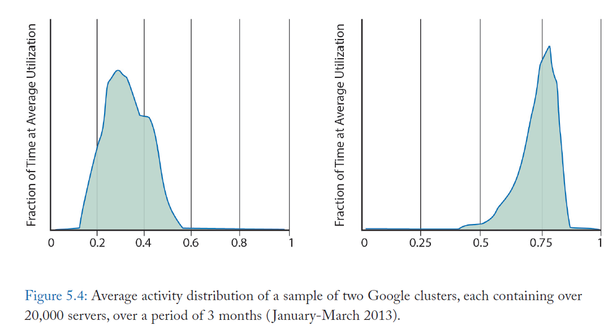
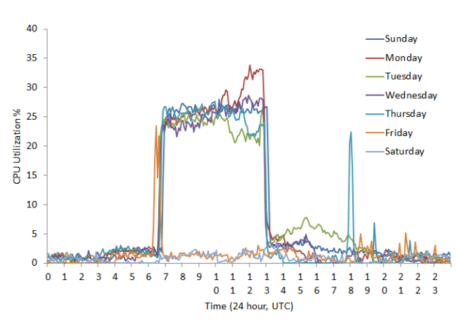
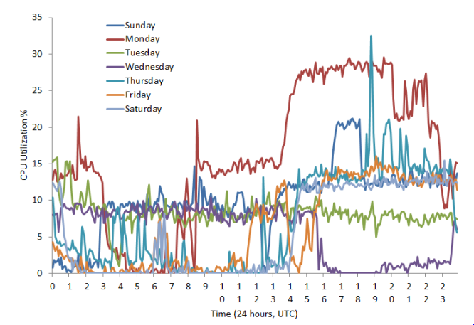

Data Center CPU Utilization
---

### Google server utilization
- [Ref](../file/BarrosoC13_The-Datacenter-as-a-Computer-An-introduction-to-design-of-warehouse-scale-machines.md)
- The figure below show three-month average utilization rates for 20,000 server clusters in Google. The typical cluster on the left spent most of its time running between **20-40 percent** of capacity, and the highest utilization cluster on the right reaches such heights only because it's doing batch work.

### Amazon
- [Ref](http://huanliu.wordpress.com/2012/02/17/host-server-cpu-utilization-in-amazon-ec2-cloud/)
- The profile of a random server

- The profile of the busiest server observed

