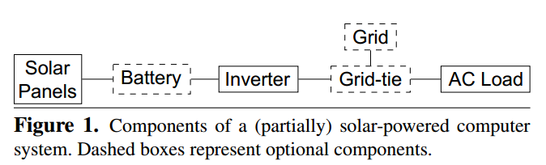

## Green Date Center Architecture

### Self Generation
- Components of a (partically) solar-powered computer systems.

  - The solar panels can be connected to batteries for storing excess energy during periods of sunlight and discharging it during other periods.
  - The datacenter must also be connected to the electrical grid via a grid-tie device if it mst be operaitonal even when solar energy is not avaialbe.
  - Net metering: feed excess solar energy into the grid for a reduciton in brown energy costs.
- Related Research
  -[[Goiri-2012]](../../papers/GoiriL12_GreenHadoop.md) use the setting that no batteries and no net metering, i.e., any green energy not immediately used will be waste.
