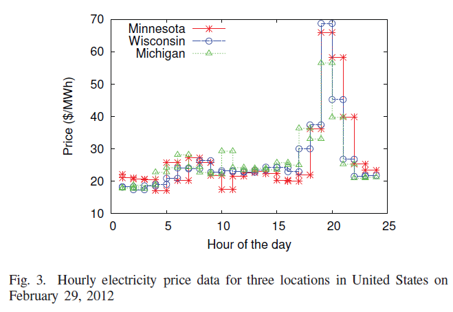

Energy Price
---

### Electricity market
- There are two types of electricity markets: Wholesale Market and Retail Market. Due to the high consumption of electricity in data centers, they usually perchase electricity from the wholesale markets [[Liu-2011]](http://dl.acm.org/citation.cfm?id=1993767). 

### Electricity price volatility
- Motivation
    - The spot power price of smart grid is adjusted dynamically in order to incentivize consumers to reduce their power demand when the grid is under stress. Consequently, power prices in different regions vary overtime and the workload processing cost in all data centers do not remain the same.
- Price variation
    - Electricity price varies on a 5-minute or 15 minute basis in real time wholesale electricity market. Electricity in this market exhibit significant volatility with high frequency variation [[Qureshi-2009]](http://dl.acm.org/citation.cfm?id=1592584)
- Power price example
    - In the following figure depicts the real time electricity prices of there different regions in North America namely Michigan, Minnesota and Wisconsin on February 29, 2012. The data reported here was obtain from the publicly available government agency [[Gov-2012]](http://www.ferc.gov/)
    - Example 
    - As shown in the figure, the electricity prices are adjusted dynamically in every hour based on the instantaneous power demand and differs significantly based on the location of use.
- Public available realtime electricity price
    - [Independent System Operator New England (ISO-NE)](http://www.iso-ne.com/), GMT-7
    - [New York Independent System Operator (NYISO)](http://www.nyiso.com/public/index.jsp), GMT-5
    - [Electric Reliability Council of Texas (ERCOT)](http://www.ercot.com/), GMT-6
    - [Electricity Market of New Zealand (NZ)](http://www.electricityinfo.co.nz/comitFta/ftapage.main), GMT+13
    
### Data center's impact on energy price
- The electricity price in the wholesale market not only depends on the location and the time of a day, but also on the locational demand and the supply of power. 
- Data centers, being massive energy consumers, are able to make a large impact on the **locational demand** of the power market. There fore, the data center operators can actively influence the price level by simply manipulating their demands which leads t o complex electricity market affecting power management.   
   
   
### How dynamic the price is?
[Le-2010](../../papers/LeB10_Managing-the-cost-energy-consumption-and-carbon-print-of-internet-services.md) make the decision of cap-and-trade policy based on the market price of carbon offsets. Using real futures market data from [PointCarbon](http://financial.thomsonreuters.com/en/resources/articles/point-carbon.html), they find that
- Although there can be periods of variability, the carbon prices exhibit consistent trends even at relatively short time scales
- It takes at least a few hours for price to change appreciably
- These observation suggest that market-based decisions will be meaningful; excessive variability or the absence of clear trends could render our decision inadequate in just a short time.In other words, the price is relatively stable in a short time, thus the scheduling scheme can be changed periodically.

### How to reduce cost?
- Data centers pften contract with their power companies to pay variable brown energy prices, i.e., different dollar amounts per kWh of consumed brown energy. The most common arragement is for the datacenter to pay **less** for brown energy consumed during an **off-peak** period (e.g., at night) than during an on-peak period (e.g., daytime). Thus, it would be profitable for the datacenter to schedule part of its workload during the off-peak perids if possible.

### Energy price in distributed data center
"Geographica load balancing" has been suggested to reduce energy cost by exploiting the electricity price differences across regions. However, this reduction of cost can paradoxically increase the total energy use [[Liu-2011]](https://github.com/hxwang/GreenDC-Summary/blob/master/LiuL11_Greening-Geographical-Load-Balancing.md).
