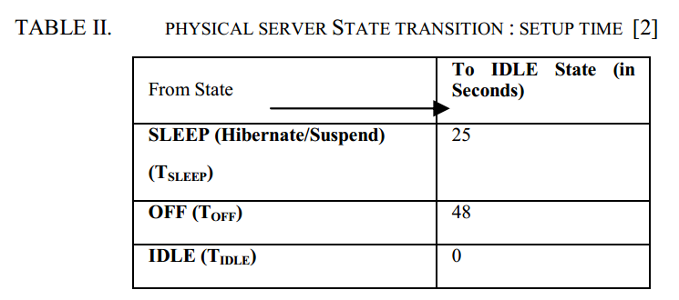

## Server State Transition

### Server State
- [[Power States]](http://en.wikipedia.org/wiki/Sleep_mode)

### Power consumption in different states
- In [[Goiri-2012]](../../papers/GoiriL12_GreenHadoop.md), there are three states of servers. Each server is a 4-core Xeon machine with 8GB RAM and 7200-rpm SATA disk with 64GB free space for data. 
	- active: executing 1-4 tasks consumes 100W, 115W, 130W and 145W
	- decommission: consumes 75W
	- sleep (ACPI S3 “Sleep” state): cosumes 9W, static power
- [[Raj-2012]](http://ieeexplore.ieee.org/stamp/stamp.jsp?tp=&arnumber=6151371)

### State transition time cost
- [[Raj-2012]](http://ieeexplore.ieee.org/stamp/stamp.jsp?tp=&arnumber=6151371), the transition time to s3 takes 24 seconds.

- [[Chen-12]](../../papers/ChenHT12-greenAware-geo-schedule.md), the transiting into and out of S3 takes 7 seconds.

### State transition energy cost

### Power ON/OFF for HPC
- [[Zhou-2014]](papers/ZhouLTD14-IBM-power-aware.md) Idle power consumption: an idle Blue Gene/P rack still has a DC power consumption of about 13kW. Thus some nodes are shut down or switched to a low-power state during the time of low system utilization. 
- In [[Pinheiro-2001]](http://citeseerx.ist.psu.edu/viewdoc/summary?doi=10.1.1.16.2690), the time used to power on the server is 100s, while the time to shut down is 45s, causing approximately 20% degradation in performance. 

### Sleep 
- Shallow sleep
	- wake up time Tup = 10s, Psleep = 10%*Pmax
- Deep sleep
	- wake up time Tup = 200s, Psleep = 5%*Pmax [[Isci-2013]](http://dl.acm.org/citation.cfm?id=2485931)

### Server power
- Pmax = 152.94W, Pidle = 63.0W, measured on the real-life AMD server [[Chen-2014]](../../papers/Chen14-IGCC-participate-in-grid.md).

### TODO
- conver the statistic value into tables to make it more clear
