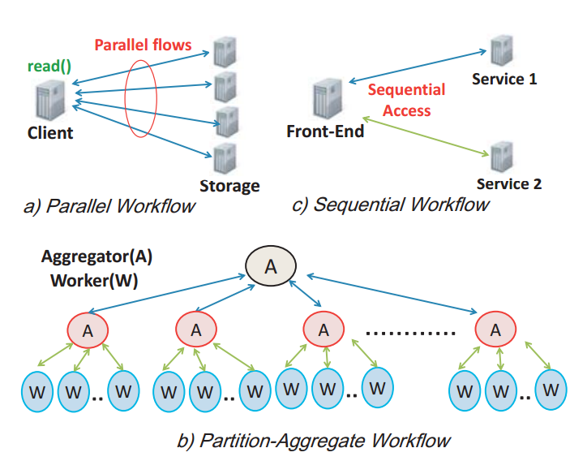

## Task-aware Scheduling

- [[Dogar-2014]](../papers/DogarK14_SIGCOMM_Decentralized-TaskScheduling-for-DCN.md)

### Definition
- Task-aware workloads: [[Dogar-2014]](../papers/DogarK14_SIGCOMM_Decentralized-TaskScheduling-for-DCN.md) define a task as the unit of work for an application that can be linked to a waiting user. 
  - Completition time: It is an important matric as it directly impacts user satisfication. 
  
|Fig: Common workflows in data center|
|:----|
||

- Task characterization
  - the task size: tasks size distribution could be different depending on applications. For some applications, all tasks can be of similar size while others many have a heavy tailed distribution. [[Dogar-2014]](../papers/DogarK14_SIGCOMM_Decentralized-TaskScheduling-for-DCN.md)
    - Hence, a general task-aware scheduling policy needs to be amenable to a wide-range of task size distributions, ranging from uniform to heavy-tailed.
  - the number of flows per task: flows per task can range from a few tens to hundreds, and as discussed earlier, subsets of flows can be active at different times and across different parts of the network.

### Motivation
Many data center applications perform rich and complex tasks (e.g., executing a search query or generating a user's news-feed). From a network perspective, these tasks typically comprise multiple flows, which traverse different parts of the network at potentially different times. [[Dogar-2014]](../papers/DogarK14_SIGCOMM_Decentralized-TaskScheduling-for-DCN.md)
- **Current (flow-based resource allocation)**: Most network task resource allocation schemes, however, treat all these flows in isolation -- rather than as part of a task, and thereofore, only optimize flow-level metrics.
  - [[PDQ-2012]](http://dl.acm.org/citation.cfm?id=2342389), [[pFabric-2013]](http://dl.acm.org/citation.cfm?id=2486031): they can support a scheduling policy like shortest flow first (SFF), which minimize flow completion times by assigning resoruces based on flow size.
- **Future (task-based resource allocation)**: This has motivated efforts to allocate data center resources in a "task-aware" fashion. Examples include task-aware allocation of caches[[Ananthanarayanan-2012]](https://www.usenix.org/conference/nsdi12/technical-sessions/presentation/ananthanarayanan), network bandwidth [[Chowdhury-2011]](http://dl.acm.org/citation.cfm?id=2018448), and CPUs and network [[Ananthanarayanan-2010]](https://www.usenix.org/conference/osdi10/reining-outliers-map-reduce-clusters-using-mantri).

### Existing Approach
- **FIFO**: Allocating network bandwidth to tasks in a FIFO fashion, such that they are scheduled over the network one at a time, can improve the average task completion time as compare to per-flow fair sharing (e.g., TCP) [[Chowdhury-2011]](http://dl.acm.org/citation.cfm?id=2018448)
  - Drawback: Since typical data center workloads include some fraction of heavy taskss (in terms of their network footprint), so obvious scheduling candidates like FIFO and size-based ordering perform poorly [[Dogar-2014]](../papers/DogarK14_SIGCOMM_Decentralized-TaskScheduling-for-DCN.md)
- **FIFO-LM**: (FIFO with limited multiplexing), a policy that schedules tasks based on their arrival order, but dynamically changes the level of multiplexing when heavy tasks are encountered. This ensures small tasks are not blocked behind heavy tasks that are, in turn, not starved [[Dogar-2014]](../papers/DogarK14_SIGCOMM_Decentralized-TaskScheduling-for-DCN.md).
  - Advantage: FIFO-LM (and even FIFO) can reduce both the average and the tail task completition times. 
    - They do so by smoothing bursty arrivals and ensuring that a tasks' completion is only impacted by tasks that arrive before it. For example, data center applications typically have multiple stages where a subsequent stage can only start when the previous stage finishes. In such scenarios, FIFO scheudling can smooth out a burst of tasks that arrive at the first stage. As a result, task observe less contention at the later stages, thereby smoothing the tail completion time. 
    
### Simulation
- How to generate task-aware workloads?
  - [[Dogar-2014]](../papers/DogarK14_SIGCOMM_Decentralized-TaskScheduling-for-DCN.md), each task has a global priority -- all flow within the task use this priority, irrespective of when these flow start and which part of the network they traverse. 
- Evaluation metric
  - average and the tail (95th percentile and beyond) completition time.
  
