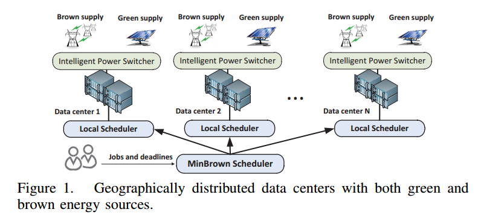

## Distributed Data Center Architecture

- Major components of a data center
  - IT equipment
  - power delivery system
  - cooling system
  
  
  - Geographically distributed data centers with both green and brown energy sources [[Chen-2012]]()
  

 ### IT equipment
 Primarily, there are three kinds of electronic equipments hosted in a typical data center
 - server for data processing
 - storage equipment for data storage
 - network equipments for data communications
 
 ### Power delivery system
 - The power delivery system mostly contains power conversion (AC to DC and DC to AC) units, voltage regulators and backup equipments. Power backup is often provided by an **uninterruptible** power supply (UPS) units which prevents IT equipment from experiencing power disruptions and possible serious business disruption or data loss.
 
 ### Cooling system
 - Cooling in a data centers is often provided by computer room air conditioning (CRAC) units. Typically, air enters the top of a CRAC unit where it is further conditioned by passing it over coils containing chilled waster pumped from a chiller located outside the building.
 - The chilled air is then supplied to the IT equipment (primarily servers) though a raised floor plenum. 
 - The code air,  while passing through perforated floor tiles, is pulled by the fans located inside the servers.
