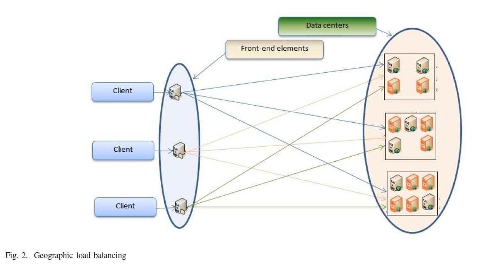

## Geographic Load Balancing

### Define and Arch

### Procedure
- ** Front-end elements**: In GLB, the client requests are initially accepted by the front-end elements and further redirected to geo-distributed data centers for processing.
- **Data center**: Sitting behind the front-end elements the data centers process the client requests using available resources as required. The decision on the amount of traffic directed from a front-end element to a data center depend on several mutually interacting objectives such as:
    - electricity price and cost, 
        - e.g., large fraction of client requests can be sent to data centers where the electricity price is cheaper. Or energy consumption can be lowerd by sending more workload to data centers located in colder regions. 
    - carbon-footprint, 
    - maximal use of renewable energy, 
    - reducing transmission delays 
    - transmission costs etc. 

