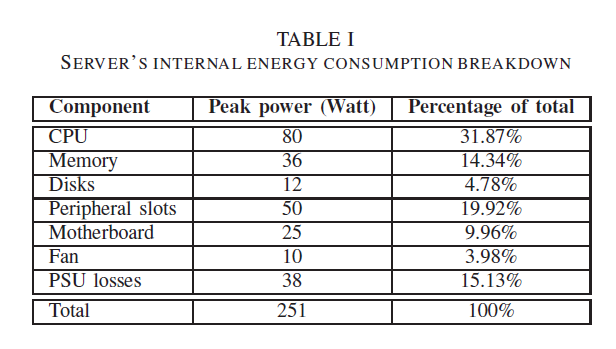

### Data Center Power Breakdown

The power break down is shown in Table 1 [[Fan-20077]](http://dl.acm.org/citation.cfm?id=1250665).   

### Power supply procedure
1. The power supplied from the main grid is delivered to the UPS. 
2. UPS converts AC power to DC power in order to charge its batteries.
3. The DC power from the batteries is further reconverted back to AC power and supplied to IT equipments through a power distribution unit (PDU).
4. Once the power researches the server, it is converted to DC power again and supplied to the server's central processing unit (CPU), memory, disk derives, chip-set. fans and other internal components.

### Observation
- Recent survey [[Greenberg-2006]](http://datacenters.lbl.gov/resources/best-practices-data-centers-lessons-learned-benchmarking-22-data-centers), power usage in more than 20 data centers found that only about half of the power entering the data is used by the IT equipment and rest half is expended in power delivery system and cooling system.

