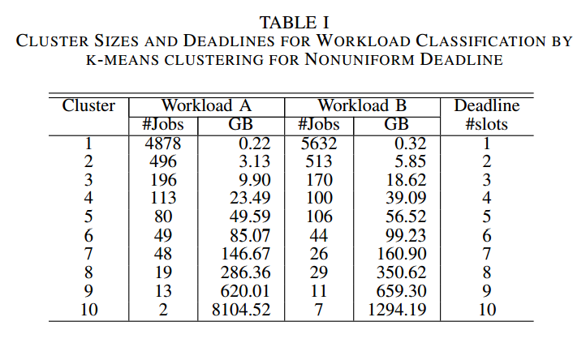
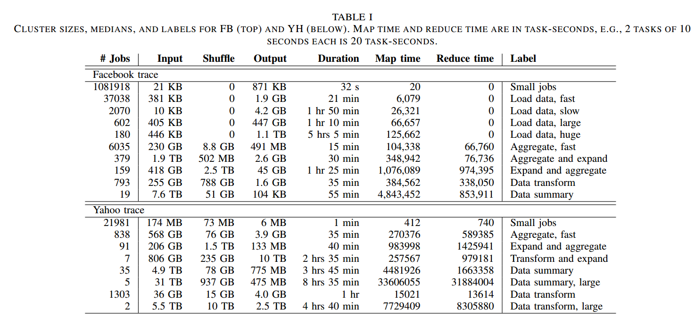

Facebook SWIM workloads
---

### Intro
- Derived from a large batch-job trace from Facebook [[Chen-2012]](http://www.odbms.org/2014/03/statistical-workload-injector-mapreduce-swim/)
- In this trace, jobs arrive throughout the day. 
- Description in [[Adnan-2012]](../papers/AdnanS12_dynamic-deferral-geoDC.md): The MapReduce traces are produced from real Facebook traces for one day (24 hours) from a cluster of 600 machines.

### Repo
- [Git-Hub-Repo](https://github.com/SWIMProjectUCB/SWIM)

### Usage
- used by [[Goiri-2013]](https://github.com/hxwang/GreenDC-Summary/blob/master/GoiriIK13_Designing-and-Managing-Datacenters-Powered-by-Renewable-Energy.md), they picked up the day Jul 1, 2012.
- used by [[Adnan-2012]](../papers/AdnanS12_dynamic-deferral-geoDC.md)

### How to process the data
- [[Adnan-2012]](../papers/AdnanS12_dynamic-deferral-geoDC.md) uses k-means clustering to classify the MapReduce workload into 10 groups based on the total sizes of map, shuffle and reduce bytes. Then jobs in small class (batch jobs) are assigned with larger deadline and larger class (interative jobs) are assigned with smaller deadline.

### Workload size
- [[Chen-2011]](http://ieeexplore.ieee.org/stamp/stamp.jsp?tp=&arnumber=6005383)

